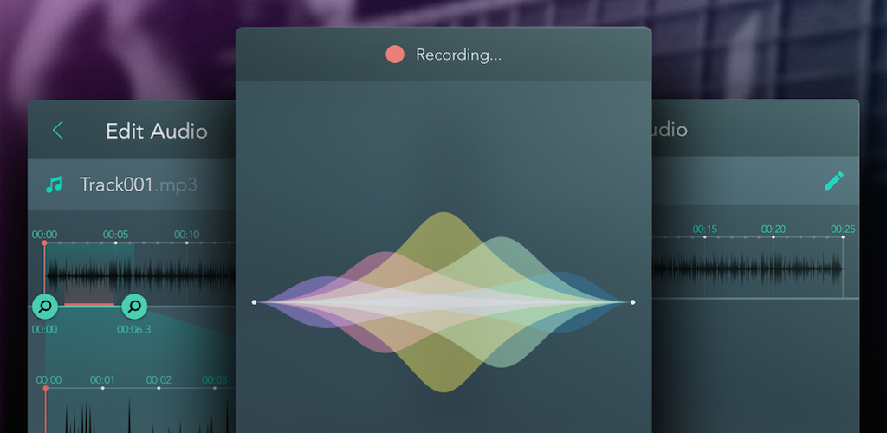
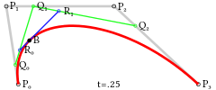

# Horizon - Simple visual equaliser for Android

#### This project aims to provide pretty cool equaliser for any Android audio project. Made in [Yalantis] (https://yalantis.com/?utm_source=github)

Check this [project on dribbble] (https://dribbble.com/shots/2452050-Record-Audio-Sample)



# Implementation

We decided to create our audio visualizer as the base for our audio projects. We wanted a solution that will work as the Android music visualizer. The result was this awesome equalizer concept that we called Horizon.

We implemented most of our sound analysis in C++. This language reduces the time required to fetch the spectrum of sounds. While most of our analysis code was written in C++, we still did minor calculations in Java to make our component easy to customize.

### How we draw a Bezier curve with Android Canvas

The equalizer consists of five waves. If you open the original .svg file in a vector image editor, you’ll see that the second wave, which corresponds to bass frequencies, is made of four cubic Bezier curves. A Bezier curve describes smooth curves mathematically. It’s possible to draw Bezier curves with Android Canvas. First, initialize paint and path. Then, add the Bezier curve to the path by calling the quadTo or cubitTo method:

```
path.reset();
path.moveTo(p0x, p0y);
path.quadTo(p1x, p1y, p2x, p2y);
path.moveTo(p0x, p0y);
path.close();
```

And finally, draw the path on the canvas:

```
canvas.drawPath(path, paint);
```

As you can see, drawing Bezier curves with Android Canvas is very easy, but performance is generally very poor.

### How to draw a cubic Bezier with OpenGL ES

OpenGL ES is very fast at drawing triangles, which means we need to come up with a way to split the shape we want into triangles. Since our wave is convex, we can approximate it by drawing many triangles, all of which have one vertex located at the center of the screen (0, 0).

Here’s the idea:

1. Split every Bezier curve into an even number of points nn.
2. Generate n−1n−1 triangles with vertices at (N1,N2,O), (N2,N3,O), …, (Nn−1,Nn,O).
3. Fill these triangles with color.

**Splitting the Bezier curve**

For each point on the Bezier curve, we are going to generate three attributes for three vertices. This is done with a simple method:

```
private float[] genTData() {
    //  1---2
    //  | /
    //  3
    float[] tData = new float[Const.POINTS_PER_TRIANGLE * Const.T_DATA_SIZE * mBezierRenderer.numberOfPoints];

    for (int i = 0; i < tData.length; i += Const.POINTS_PER_TRIANGLE) {
        float t = (float) i / (float)tData.length;
        float t1 = (float) (i + 3) / (float)tData.length;

        tData[i] = t;
        tData[i+1] = t1;
        tData[i+2] = -1;
    }

    return tData;
}
```

Attributes of the first two vertices specify points on the curve. The attribute for the third vertex is always -1, which by our convention means that this vertex is located at (0,0)(0,0).

Next, we need to pass this data to a shader.

### Shader pipeline

We’ll use the following variables of the OpenGL Shading Language:

**Uniforms** (common for the entire wave):

* vec4 u_Color – Color of the wave
* float u_Amp – Sound level of the wave
* vec4 u_BzData – Start and end points of the Bezier curve
* vec4 u_BzDataCtrl – Two control points of the Bezier curve

**Attribute** (per individual vertex):

* float a_Tdata – interpolation coefficient tt (specifies point on the curve)

Now, given the start, end, and control points of a curve, as well as tt, we need to find the location of the point on the curve.

Let’s look at the formula for a cubic Bezier:


It’s easy to translate this directly into GLSL:

```
vec2 b3_translation( in vec2 p0, in vec2 p1, in vec2 p2, in vec2 p3, in float t )
{
    float tt = (1.0 - t) * (1.0 - t);

    return tt * (1.0 - t) * p0 +
        3.0 * t * tt * p1 +
        3.0 * t * t * (1.0 - t) * p2 +
        t * t * t * p3;
}
```

But we can do better. Let’s look at the geometric explanation of a cubic Bezier curve:



With the help of GLSL’s mix function, we interpolate between points and almost program declaratively:

```
vec2 b3_mix( in vec2 p0, in vec2 p1,
        in vec2 p2, in vec2 p3,
        in float t )
{
    vec2 q0 = mix(p0, p1, t);
    vec2 q1 = mix(p1, p2, t);
    vec2 q2 = mix(p2, p3, t);

    vec2 r0 = mix(q0, q1, t);
    vec2 r1 = mix(q1, q2, t);

    return mix(r0, r1, t);
}
```

This alternative is much easier to read and, we think, is equivalent in terms of speed.

### Color blending

To tell OpenGL that we want screen-like blending, we need to enable GL_BLEND and specify the blend function in our onDrawFrame method before actually drawing the waves:

```
GLES20.glEnable(GLES20.GL_BLEND);
GLES20.glBlendFuncSeparate(
    GLES20.GL_ONE, GLES20.GL_ONE_MINUS_SRC_COLOR,
    GLES20.GL_ONE, GLES20.GL_ONE_MINUS_SRC_ALPHA
); // Screen blend mode
```

# Usage

*For a working implementation, please have a look at the Sample Project - sample*

<a href="https://play.google.com/store/apps/details?id=com.yalantis.horizon&utm_source=global_co&utm_medium=prtnr&utm_content=Mar2515&utm_campaign=PartBadge&pcampaignid=MKT-AC-global-none-all-co-pr-py-PartBadges-Oct1515-1"></a>

1. Include the library as local library project.

    ``` compile 'com.yalantis:eqwaves:1.0.1' ```

2. Initialize Horizon object with params regarding to your sound

    ```java
    mHorizon = new Horizon(glSurfaceView, getResources().getColor(R.color.background),
                    RECORDER_SAMPLE_RATE, RECORDER_CHANNELS, RECORDER_ENCODING_BIT);
    ```

3. To update Horizon call updateView method with chunk of sound data to proceed

	```java
   byte[] buffer = new byte[bufferSize];
   //here we put some sound data to the buffer
   mHorizon.updateView(buffer);
    ```
# Compatibility

  * Library - Android ICS 4.0+
  * Sample - Android ICS 4.0+

# Changelog

### Version: 1.0.1

  * Version update

### Version: 1.0

  * Initial Build

### Let us know!

We’d be really happy if you sent us links to your projects where you use our component. Just send an email to github@yalantis.com And do let us know if you have any questions or suggestion regarding the library.

## License

    Copyright 2017, Yalantis

    Licensed under the Apache License, Version 2.0 (the "License");
    you may not use this file except in compliance with the License.
    You may obtain a copy of the License at

       http://www.apache.org/licenses/LICENSE-2.0

    Unless required by applicable law or agreed to in writing, software
    distributed under the License is distributed on an "AS IS" BASIS,
    WITHOUT WARRANTIES OR CONDITIONS OF ANY KIND, either express or implied.
    See the License for the specific language governing permissions and
    limitations under the License.
